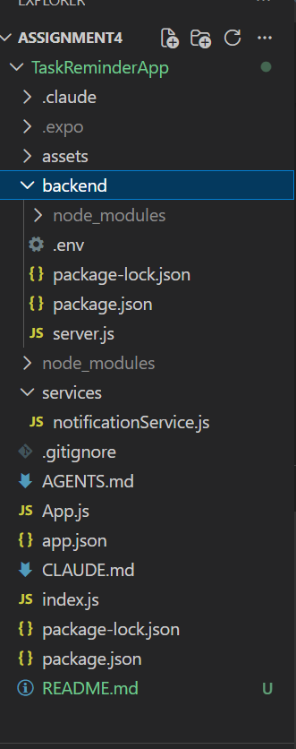
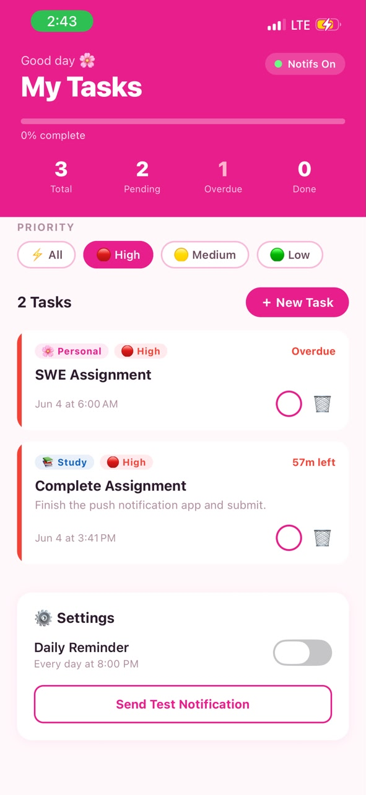
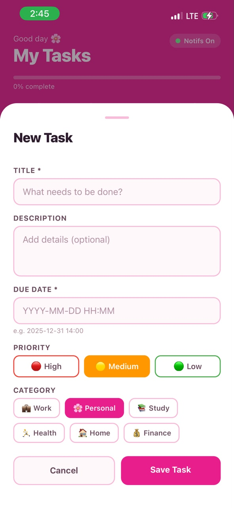
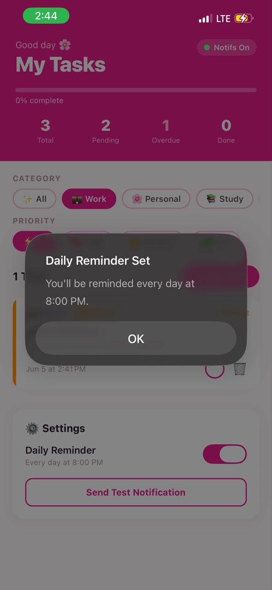
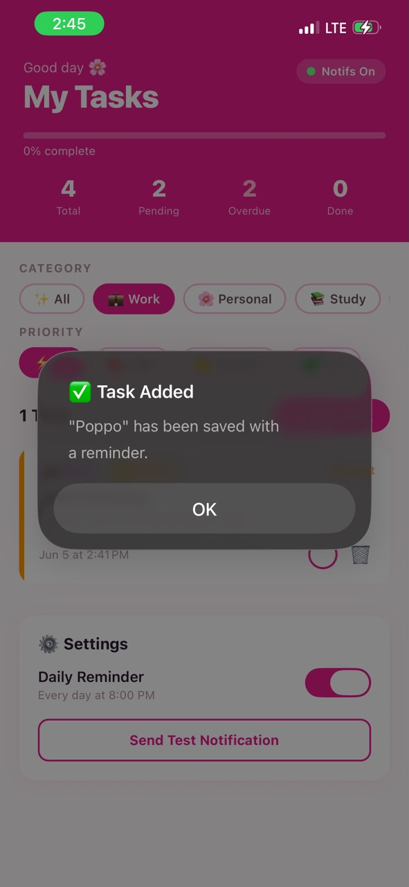
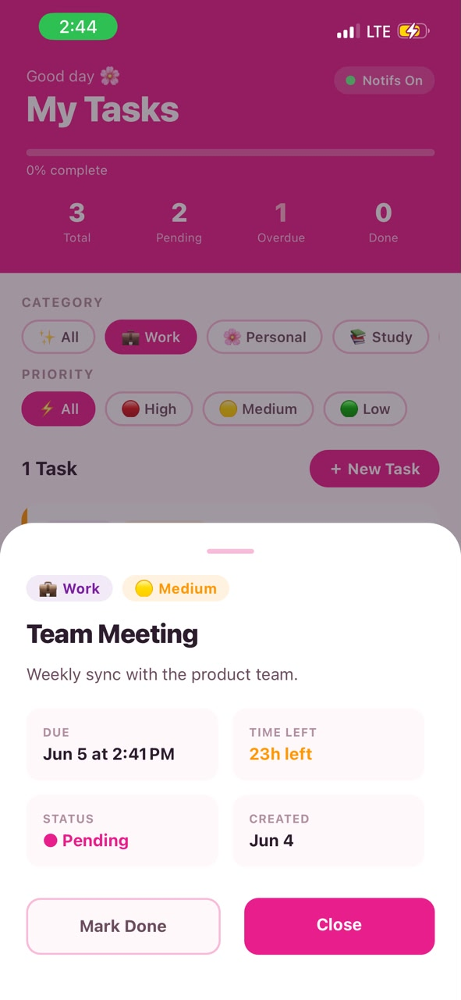

# 📱 TaskReminderApp

> A React Native mobile app created using React Native and Expo which allows users to keep track of all of their tasks by sending notifications based on the deadlines.

---

## 📋 Table of Contents

- [About the App](#about-the-app)
- [Features](#features)
- [Tech Stack](#tech-stack)
- [Getting Started](#getting-started)
- [Project Structure](#project-structure)
- [Notification System](#notification-system)
- [API Endpoints](#api-endpoints)
- [Screenshots](#screenshots)

---

## 🌸 About the App

**TaskReminderApp** is a productivity application designed to solve the issue of forgetting your deadlines. This mobile app allows users to set their tasks along with their deadlines and it automatically sends reminders before their deadline ends.

**Domain:** Task Management & Productivity

**Primary Use Case Scenario:**
The primary user is someone who requires assistance in remembering his or her deadlines. The app helps through the following:

1. **Task Creation** – Create a task with the name, description, and deadline.
2. **Getting Notified** – Get notifications ten minutes before the deadline.
3. **Planning for the Next Day** – Get daily reminders at 8:00 PM about the next day’s tasks.

---

## ✨ Features

| Feature              | Description                                           |
|----------------------|-------------------------------------------------------|
| + Task Management    | Creating, completing, and deleting tasks with deadlines |
| 🕒 Auto Reminders    | Local notification 10 minutes prior to all deadlines   |
| 📅 Daily Reminder    | Option to receive a reminder to look at tasks         |
| 🔔 Push Notifications| Receive remote notifications from your own server      |
| 📲 Notification Types| Function in all states, such as foreground or terminated|
| 🗂 Task Categories   | Task categorization into categories of work etc.       |
| 🎯 Priority Levels   | Prioritize tasks as either high, medium or low        |
| 📊 Progress Bar      | Task completion progress indicator                   |

---

## 🛠 Tech Stack

**Mobile App**
- React Native
- Expo SDK 54
- expo-notifications
- expo-router
- expo-dev-client

**Backend Server**
- Node.js
- Express.js
- Expo Push Notification Service
- Port: 3000 (default)

---

## Getting Started

### Prerequisites

Make sure you have the following installed:
- Node.js
- npm or yarn
- Expo CLI
- A physical iOS or Android device
- Git

### Step 1 — Clone the Repository

```bash
git clone https://github.com/Yesheylhaden/SWE201_Asignment4_TaskReminderApp.git
cd SWE201_Asignment4_TaskReminderApp/TaskReminderApp
```

### Step 2 — Install Mobile App Dependencies

```bash
npm install
```

### Step 3 — Install Backend Dependencies

```bash
cd backend
npm install
```

### Step 4 — Start the Backend Server

```bash
node server.js
```

The server will run at `http://localhost:3000`

### Step 5 — Start the Mobile App

```bash
cd ../TaskReminderApp
npx expo start
```

Scan the QR code with **Expo Go** (development) or your **dev client build** (for full push notification support).

---

## 📁 Project Structure

```
Assignment4/
├── TaskReminderApp/          # React Native mobile app
│   ├── assets/               # Images and icons
│   ├── services/
│   │   └── notificationService.js
│   ├── App.js                # Main app component
│   ├── app.json              # Expo config
│   └── package.json
└── backend/                  # Express.js server
    ├── server.js
    └── package.json
```



---

## 🔔 Notification System

### Local Notifications
Scheduling takes place directly on the device using the Expo Notifications API with `scheduleNotificationAsync()` function. Internet connectivity is not necessary.

- Alerts are triggered 10 minutes prior to deadlines of tasks
- Daily reminder alert at 8:00 pm (optional and customizable by user)
- A test notification can be sent from the settings page

### Remote Push Notifications
Triggered by backend application through the Expo Push Notification Service. Requires registration of the device push token.

- Push token gets registered by the device at the start of the app
- Targeted or broadcast notifications can be sent by backend 
- Push tokens are saved on the server

---

## 🌐 API Endpoints

| HTTP Verb | Endpoint | Explanation |
|-----------|----------|-------------|
| `POST`    | `/api/register-token` | Register device push token |
| `POST`    | `/api/send-notification` | Send notification to a certain device |
| `POST`    | `/api/broadcast` | Broadcast notifications to all devices |
| `GET`     | `/api/tokens` | Show all registered tokens |

---

## 📸 Screenshots

### Homepage - Tasks List

Dashboard showing task statistics (Total, Pending, Overdue, Done), progress bar, categories, priorities, and the task list.

### Create a New Task

Modal bottom sheet for creating tasks using the task title, description, due date, priority level, and category selection.

### Enable or Disable Daily Reminder

Settings screen displaying the daily reminder toggle with the notification that the reminder is set for 8:00 PM.

### Task Successfully Added

Screen showing success on adding a task, along with the updated statistics.

### View Selected Task

Screen displaying detailed information about the selected task such as the due date, time left, task status, completion options, etc.

---

## Conclusion
The TaskReminderApp has managed to showcase an implementation of both local and remote push notifications for a React Native mobile application developed using Expo. This app enables you to create your tasks and have automatic deadline notifications in order to organize yourself with daily notifications — powered by a minimal Express.js server.
In addition to the push notification capability, the app also incorporates a professional UI design in pink and white, including categorization, prioritization, and progress management capabilities in order to make a comprehensive and useful productivity app.
The experience gained throughout this project is highly practical for today's mobile applications development.

---

## 👩‍💻 Developer

**Yesheylhaden** — SWE201 Assignment 4

---